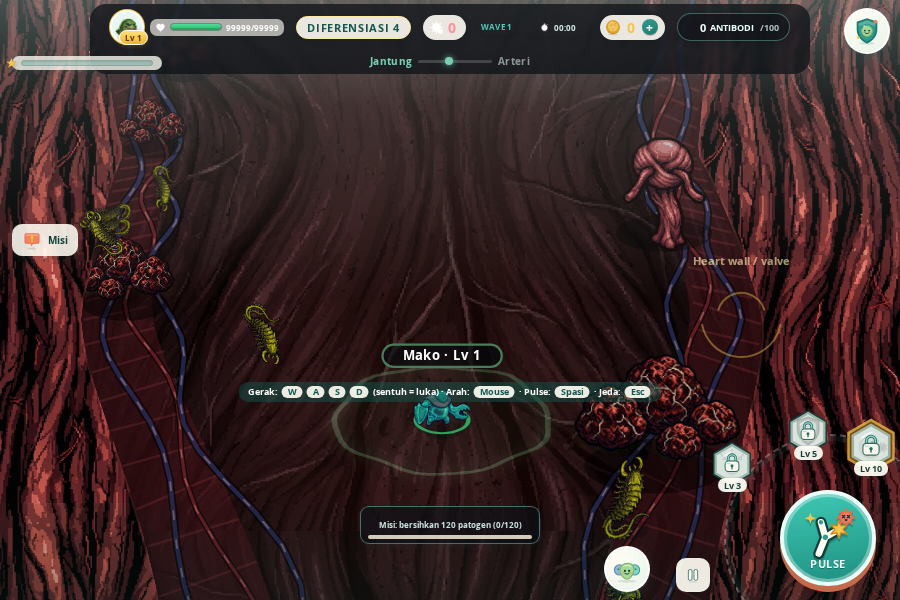
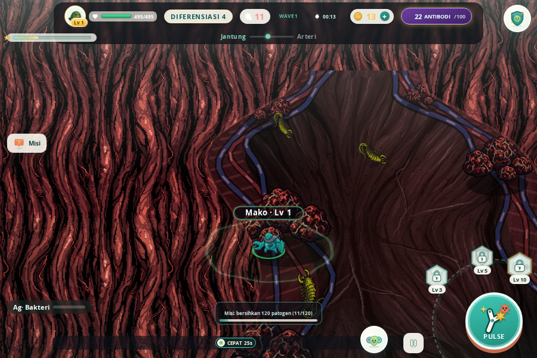
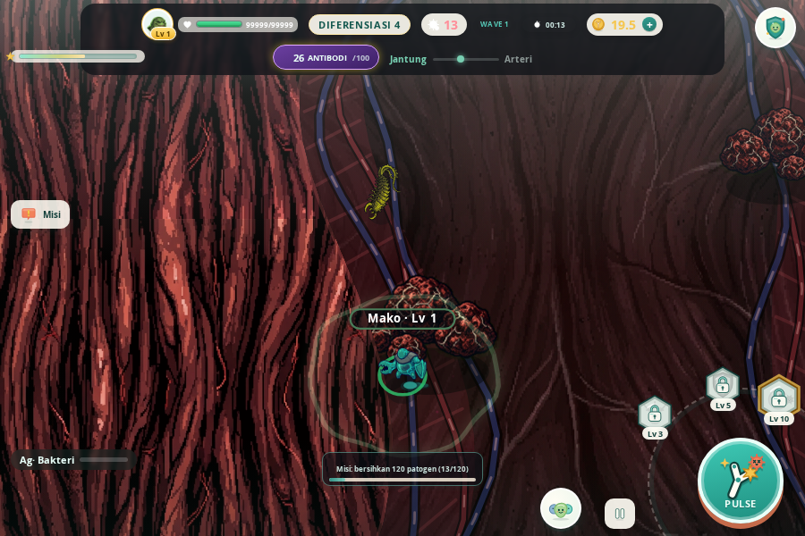
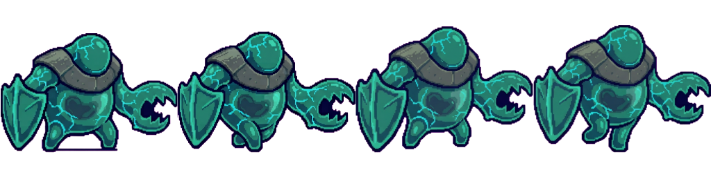
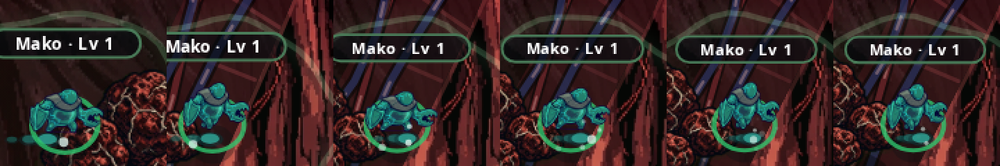

# PHAGOS — Laporan PILOT: Arena "Organ Ascent" (Bilik Jantung) + Character "Abstract Bio-Form" (Mako)

> **CATATAN UI-RESET (2026-09-21):** seluruh screenshot di `docs/pilot-jantung/`
> **sudah dihapus** bersama arah pixel-art/"Last Asylum" yang dibatalkan owner lewat
> video referensi. Tautan gambar di dokumen ini karena itu tidak lagi menunjuk ke
> berkas. Penggantinya — snapshot arah BARU (before/after) — ada di
> `docs/vision-snapshot/` (lihat `docs/VIDEO-REFERENCE-ANALYSIS.md`).
> Isi laporan teknis di bawah dipertahankan sebagai riwayat keputusan.

**Status:** pilot divalidasi owner → **SUDAH DI-SCALE** (lihat §7). Bagian §1–§6 = laporan pilot asli.
**Rujukan mandat:** `docs/ARENA-CHARACTER-REDESIGN-STRATEGY.md` (§5, §6, §8) dan
`docs/AGENT-KICKOFF-ARENA-CHARACTER.md`.
**Scope:** 1 organ (`jantung`) + 1 hero (`macrophage`). 6 organ & 10 hero lain
TIDAK disentuh — jalur kode lama tetap dipakai apa adanya untuk mereka.

---

## 1. Dua koreksi fakta terhadap dokumen strategi (ditemukan saat audit kode)

| Asumsi di dokumen | Kenyataan di kode | Dampak ke pilot |
|---|---|---|
| "Mode bawaan sekarang `makhluk`" (CHARACTER-PROTOTYPE-EVAL) | `hero-mode.js` bawaan = **`foto`**, dan `verify-prototype.mjs` **mengunci** itu dengan asersi. Yang tampil untuk Mako = PNG chibi bermata (persis yang dibatalkan owner). | Pilot character bukan cuma "pertajam rig" tapi juga **mengaktifkan** rig sebagai bawaan khusus hero pilot + memutar asersi test. |
| "Arena ditentukan `meta.selectedArena`" | Palet & organ ditentukan **`world-journey.js`** (zona perjalanan: paru → … → jantung → …). `selectedArena` hanya fallback. | Bentuk koridor harus mengikuti **zona**, dipasang/dilepas saat zona berganti — bukan sekali di `startRun`. |

## 2. Keputusan atas poin terbuka (§5c / §6b / §8) + alasan

| Poin | Keputusan | Alasan |
|---|---|---|
| Jalur tunggal vs bercabang | **Tunggal** | Spawn/pacing/clamp cukup O(1) per entitas (`halfAt(y)`), bisa dibuktikan cepat. Cabang = poligon + kamera lebih rumit; ditunda sampai pola terbukti. |
| Kamera | **Tetap top-down** (pipeline `makeProjector` tidak diubah) | Kamera sudah "melihat ke atas": `ANCHOR_Y` menaruh player di bawah layar dan perspektif mengecilkan yang jauh di atas — cocok untuk membaca koridor vertikal tanpa menyentuh proyeksi hero/telegraph/membran. |
| Organ pilot | **Bilik Jantung** | Sesuai rekomendasi doc; sudah punya bpm/pulse & mekanik `heartbeatPulse` di journey. |
| Urat/otot: dekorasi atau gameplay? | **Visual struktural saja** (dinding = collision, tapi urat/otot tidak mendorong/menghalangi) | Mandat batasan: mekanik harus identik. Fungsional = kode gameplay baru = di luar pilot. Struktur data (`shape.wall`) sudah siap ditambah efek nanti. |
| Format run | **Tetap gelombang-bertahan** (bukan "sampai puncak") | Mengubah kondisi menang = mengubah mekanik & objective bab — di luar scope. Koridor tinggi 3200 unit memberi arah "naik" tanpa memaksa. |
| Luas arena | **Setara cawan lama** (1,79 jt vs 1,77 jt unit², 1,01×) | Kepadatan spawn & jangkauan pickup tidak berubah → gameplay terasa sama padatnya, hanya bentuknya terarah. |
| Tingkat abstraksi | **Hybrid** (siluet biologis disederhanakan jadi ikon) | Rig makrofag = blob + kaki pseudopodia (biologis) + penanda ikonik: ruffle membran, **mangkuk fagosit** di depan (pengganti lamelipodium polos), **vakuola** isi. Terbaca dari jauh, tanpa wajah. |
| Prosedural vs aset | **Prosedural-vektor** (extend `creature-rig.js`, data-driven) | Field baru (`body.ruffle`, `front.cup`, `vacuoles`) opsional → hero lain otomatis tidak berubah. Tidak butuh brief seni eksternal. |
| Pembanding lama | Tetap tersedia | `?heroMode=foto` / tombol M / Lab (P) — pilihan eksplisit mengalahkan bawaan pilot. |

## 3. Yang berubah (ringkas)

**Arena (baru)**
- `js/systems/arena-shape.js` — profil lebar-per-tinggi (Catmull-Rom) → `halfAt(y)`, `centerAt(y)`, `clampToShape`, `insideShape`, `outsideDistance`, `wallPolyline`. Satu sumber kebenaran untuk collision **dan** visual.
- `js/render/organ-corridor.js` — jaringan luar gelap, pita serat otot berdenyut (bpm palet), 3 pembuluh per sisi (vena/arteri) dengan aliran **naik**, korda tendinea, rim.
- `data/arenas.json` (`jantung`) — blok `shape` (profil apeks → bilik → katup → serambi → aorta, luas setara cawan), `flowcell` diputar mengalir ke atas, `fold` jadi serat vertikal tipis.
- `js/core/game.js` — `run.arenaShape` (null = cawan lama); `syncArenaShape()`; `arenaClamp`/clamp spawn/kill proyektil memakai shape bila ada; `renderArenaWall` (lingkaran) di-skip saat koridor aktif.
- `js/systems/world-journey.js` — pergantian zona memanggil `syncArenaShape`; `_jumpToZone()` untuk penguji/lab.

**Character (pilot Mako)**
- `js/render/hero-mode.js` — `PILOT_CREATURE_HEROES = ['macrophage']`, `heroModeFor(heroId)`; mode eksplisit tetap menang; `resetHeroMode()`.
- `js/render/creature-rig.js` — ruffle membran, mangkuk fagosit, vakuola fagositosis (semua opsional dari data).
- `data/creature-rigs.json` — hanya entri `macrophage` ditambah field di atas + warna sedikit lebih kontras terhadap tanah merah muda jantung.
- Lab & tombol "Mode hero" menampilkan mode **efektif** hero yang dimainkan.

**Test**
- `tools/verify-prototype.mjs` — asersi "bawaan = foto" diganti: global tetap foto, hero pilot = makhluk, eksplisit foto menang; render arena diferensial per hero (pilot vs non-pilot); rig pilot tanpa fitur wajah & punya penanda identitas; hero lain tidak berubah.
- `tools/verify-world.mjs` — 11 cek PILOT baru: hanya jantung berkoridor, aktif/lepas saat zona berganti, luas ±15%, vertikal (tinggi ≥ 3× lebar), melebar-menyempit, 400 clamp acak + 40 spawn di dalam siluet, pemain tertahan dinding, HP/speed identik, kembali ke cawan berpusat pemain, render tanpa error/NaN.
- `scripts/e2e-pilot-jantung.mjs` — Playwright: run nyata di zona jantung, screenshot wide/naik/dinding + crop hero 4×, metrik posisi/HP.

## 4. Hasil verifikasi

```
npx esbuild --bundle js/main.js --outfile=.tmp-bundle.js --format=iife   ✔
node tools/verify-animasi.mjs    === ERROR (0) ===
node tools/verify-crawl.mjs      === ERROR (0) ===
node tools/verify-prototype.mjs  === ERROR (0) ===   (asersi diperbarui, +6 cek)
node tools/verify-world.mjs      === ERROR (0) ===   (+12 cek PILOT)
node tools/verify-rive/combat/economy/p5/gamefeel/attacks.mjs  === ERROR (0) ===
node scripts/check-imports.mjs   Semua pemeriksaan lolos ✔
```
`verify-visual` (23) / `verify-screens` (7) / `validate-catalog` (3) gagal **sama persis di base branch sebelum perubahan ini** (aset foto latar & katalog toko — di luar scope, tidak disentuh).

**Bukti mekanik identik (e2e, 4 dtk jalan naik + 4 dtk kiri, hero speed sama):**
before (cawan): (0,0) → (0,−735) → (−710,−188) — tertahan lingkaran r=735.
after (koridor): (0,0) → (0,−1662) → (−258,−1662) — tertahan dinding kiri bilik (halfAt = 258+radius).
HP 99999 → 99999 di keduanya; jarak tempuh vertikal per detik identik (perbedaan hanya di mana dinding menahan).

## 5. Screenshot (Playwright, Chromium headless, 900×600) — `docs/pilot-jantung/`

| | Before | After |
|---|---|---|
| Arena (spawn) | `before-arena-wide.png` — pipa besar melintang acak, tak ada batas terlihat | `after-arena-wide.png` — koridor bersiluet, dinding otot bergaris, urat mengalir naik |
| Arena (naik 4 dtk) | `before-arena-up.png` | `after-arena-up.png` — katup menyempit terbaca di atas |
| Mentok dinding | `before-arena-wall.png` — garis putus lingkaran kaca | `after-arena-wall.png` — jaringan gelap di luar siluet |
| Hero crop 4× | `before-hero-crop-4x.png` — chibi bermata/bermulut | `after-hero-crop-4x.png` — blob bermembran berkerut, nukleus, vakuola, mangkuk depan; tanpa wajah |
| Lab | — | `after-lab.png` — ③ ditandai "Dipakai di arena" |

## 6. Rekomendasi scale: **LANJUT dengan 2 revisi kecil dulu**

Siap di-scale karena: (1) pola data-driven — organ baru = blok `shape.profile` (belasan angka) + warna `wall`, hero baru = 3 field opsional di rig; (2) 0 perubahan di mekanik terbukti oleh test; (3) jalur lama tetap utuh sebagai fallback.

Sudah dikerjakan di PR ini (revisi #1): **zoom-out ringan saat di koridor** — layer `corridorScale` di `Camera` (independen dari zona/punch, tanpa getar), target dari `shape.cameraZoom` (jantung 0,88), kembali 1 saat keluar koridor; dicek `verify-world`. Screenshot `after-*` sudah memakai zoom ini.

Yang masih butuh keputusan owner sebelum 6 organ lain:
1. **Musuh dari bawah** — spawn masih radial di sekeliling player (mekanik lama, sengaja tidak diubah). Untuk rasa "didaki", bias spawn ke bawah (y > player) bisa jadi tweak `getSpawnPosition` opsional per-shape — ini perubahan gameplay ringan, butuh keputusan owner.
2. Untuk **paru** (bercabang) profil tunggal tidak cukup — perlu ekstensi `kind:'branch'` (2–3 koridor bergabung). Pola `halfAt/centerAt` masih bisa dipakai per cabang.

Hero berikutnya: neutrophil & dendritic sudah punya rig penuh; cukup tambah `PILOT_CREATURE_HEROES` + field identitas (granula multi-lobus / dendrit) — tanpa kode baru di renderer kecuali bentuk khas yang diinginkan.

---

## 7. SCALE (setelah validasi owner) — 7 organ + 7 hero + bias spawn

Keputusan owner: scale ke **semua 6 organ termasuk paru** dan **aktifkan bias spawn dari bawah**.

### Arena — 7 organ bersiluet
| Organ | kind | Siluet | Luas vs cawan | cameraZoom | spawnBias |
|---|---|---|---|---|---|
| limfe | corridor | pembuluh berkatup: 4 sinus melebar–menyempit | 0,95× | 0,90 | 0,65 |
| lambung | corridor | kardia → fundus lebar → antrum → pilorus sempit | 1,04× | 0,86 | 0,50 |
| **paru** | **branch** | bronkus → karina → 2 bronkiolus kiri/kanan → alveoli | 1,04× | 0,84 | 0,60 |
| saraf | corridor | akson panjang, 3 nodus Ranvier, badan sel di puncak | 1,05× | 0,90 | 0,70 |
| jantung | corridor | (pilot) apeks → bilik → katup → serambi → aorta | 1,01× | 0,88 | 0,60 |
| kapiler | corridor | terowongan tersempit, berkelok, panjang 5200 | 0,99× | 0,95 | 0,80 |
| aliran_darah | corridor | pembuluh besar lebar, kelok halus | 1,04× | 0,86 | 0,75 |

- `arena-shape.js` diperluas: `kind:'branch'` = gabungan **lajur** (`lanes[]`, tiap lajur profil sendiri + rentang `t0..t1`). `insideShape`/`clampToShape`/`outsideDistance` bekerja per lajur terdekat; `halfAt/centerAt` tetap = lajur utama (kompatibel). Semua flowcell 7 organ kini mengalir **ke atas**.
- `organ-corridor.js`: jaringan luar = layar penuh dilubangi gabungan lajur (offscreen `destination-out`) → cabang paru yang tumpang tindih tidak bocor; lapisan otot/pembuluh di-klip ke gabungan lajur. Fallback tanpa DOM untuk penguji jsdom.
- **Bias spawn** (`game.organSpawnPosition`): porsi `spawnBias` musuh dipaksa datang dari **bawah** pemain (jarak spawn tetap rumus lama → tekanan sama, arah berubah); tanpa shape = radial lama persis. Ini satu-satunya perubahan gameplay, disetujui owner.
- Fallback cawan tetap utuh: organ tanpa blok `shape` → lingkaran r=750 berpusat pemain (diuji).

### Character — 7 hero ber-rig, identitas dari siluet
`PILOT_CREATURE_HEROES` = 7 hero yang sudah punya rig; 4 hero tanpa rig (tcd4, treg, bcell, nkcell) otomatis tetap foto sampai rignya dipanggang. Field baru di `creature-rig.js` (semua opsional, data-driven):
- `nucleus.lobes/lobeSpread/lobeAngle` — nukleus berlobus (neutrofil 3, eosinofil 2, basofil 2)
- `granules` — butir sitoplasma padat (eosinofil besar oranye, basofil besar gelap, mast cell sedang, neutrofil halus)
- `spikes` — tonjolan membran: dendrit bercabang (dendritik), vili rapat (mast cell), mikrovili tajam sedikit (tcd8)
- `ruffle` juga dipakai dendritik & basofil; `front.cup` sempit-tajam untuk tcd8 (sinaps)
Uji: 7 kombinasi penanda **semuanya berbeda** (bukan Mako diwarnai ulang), tanpa fitur wajah, alas tetap 0,42×S. Organel dipudarkan (alpha 0,32) dan lobus disusun miring/vertikal supaya tidak pernah terbaca sebagai sepasang mata.

### Verifikasi
`animasi / crawl / prototype / world` = **ERROR (0)**. `verify-world` kini +22 cek ORGAN ASCENT (per-organ luas/vertikal/clamp, paru bercabang, bias spawn, fallback cawan, kamera per organ, render tanpa NaN). e2e Playwright dijalankan untuk **ke-7 zona** (0 error browser) — `docs/pilot-jantung/organ-*-arena-up.png` + `after-hero-sheet.png` (7 hero × samping/depan/belakang/idle, render `drawCreature` asli).

### Yang masih terbuka
- 4 hero tanpa rig (tcd4, treg, bcell, nkcell): perlu dipanggang lewat `npm run bake:creature` (Godot) sebelum bisa ikut — di luar kemampuan sandbox ini.
- Elemen anatomi masih visual; arus/otot fungsional (mendorong/menghalangi) tetap menunggu keputusan terpisah.

---

## 8. REVISI OWNER — "masih jauh dari standar industri": pilot PIXEL-ART (jantung + Mako + 3 musuh)

Kritik owner: karakter bulat tanpa bentuk, arena "HTML5 polos". Riset referensi
(Brotato, Death Must Die, Halls of Torment, Hades) → pola industri: **lantai gelap
bertekstur rendah kontras, sprite terang dengan outline gelap dan siluet
beranggota (lengan/senjata/kaki), prop bervolume dengan bayangan, FX terang di
atasnya.** Owner memilih: sprite sheet dibuat di sandbox · gaya pixel-art gelap ·
pilot ulang 1 arena + Mako + 3 musuh.

### Yang berubah (visual saja — radius/HP/collision/kecepatan tidak disentuh)
| Elemen | Sebelum | Sesudah |
|---|---|---|
| Mako | rig vektor bulat | sprite pixel-art `px/hero_macrophage_{idle,attack}.png` (badan amoeboid berzirah, lengan-rahang fagosit, lengan-perisai membran, 3 kaki; tanpa wajah) |
| bakteri / virus / parasit | foto kartun bermata | sprite pixel-art (grub berduri berflagela · ikosahedron berkaki injektor · cacing lintah bermulut pengisap); `spriteScale` 1.35 visual saja |
| lantai jantung | gradasi merah muda terang | tile otot gelap `px/floor_jantung.png` (ruang dunia, ikut kamera) + vignette lateral |
| dinding | jaringan flat + pita salmon | tile `px/wall_jantung.png` + bayangan 110 unit jatuh ke lantai; pita otot jadi overlay redup |
| pembuluh | garis neon di atas lantai | selubung gelap + inti redup (terlihat tertanam) |
| korda | garis tipis | prop bervolume `px/prop_trabecula.png` / `px/prop_clot.png` dengan bayangan, ditempatkan dekat dinding (tengah jalur tetap lega) |
| medan membran | cakram susu menutupi sprite | cincin tanah bercahaya (isi 0,28×), radius sama |
| bayangan entitas | 0,13–0,16 kehijauan | 0,28–0,34 hampir hitam |

Semua data-driven: `shape.wall.{floor,floorTile,wallTex,wallTile,cordProps,cordSize}` di
`data/arenas.json`; organ lain tanpa field ini → tampilan sebelumnya. Pipeline:
`generate_image` → `tools/key-sprites.mjs` (chroma-key + crop + downscale di Chromium).




### Verifikasi
esbuild OK; `animasi / crawl / prototype / world` = **ERROR (0)** (asersi "Mako = makhluk vektor"
diganti "Mako = sprite px + 3 musuh px + data lantai/dinding/prop jantung"). e2e
`TAG=px ZONE=heart COMBAT=1`: 0 error browser.

### Belum / berikutnya bila disetujui
- 8 arah / animasi jalan (saat ini idle+attack + flip, condong, squash — sama seperti sistem lama).
- Sprite px untuk 10 hero lain + 9 musuh lain, dan tile lantai/dinding 6 organ lain.
- Kepadatan HUD (bukan bagian pilot ini).

## 9. Brief owner "Last Asylum: Plague" → kamera 58°, arc-turn, secondary lag

Pemetaan brief 3D ke pipeline Canvas 2.5D kita (mekanik tidak berubah):

| Brief | Implementasi | Nilai |
|---|---|---|
| Pitch 58° | `PERSP.YS = sin(58°)` (dulu 0,5 ≈ 30°) | 0,85 |
| FOV 26–30° telefoto | `PERSP.K` 1,7 → 1,0, klem persp 0,62–1,7 (garis dinding lurus di tepi, kedalaman tetap) | — |
| SmoothDamp 0,18 s + look-ahead | sudah ada: `FOLLOW_RATE 5.2` (τ≈0,19 s), `LOOK_MAX 120` arah gerak | dipertahankan |
| Turn speed 720°/s, arc-turn | sudah ada untuk input (`turn.rate` 13 rad/s ≈ 745°/s); **baru**: `visFacing` — badan sprite mengejar `facing` mekanik dengan batas laju sama, sehingga mouse-aim instan (untuk serangan) tidak lagi membuat sprite mirror seketika | 13 rad/s |
| Stride sync anti-skate | sudah ada: `walkPhase` terkunci jarak (`stride`) | — |
| Pelvis bob 2× per siklus | bob ±0,14·radius dari `walkPhase·2`, hanya untuk hero sprite px | — |
| Bone chain jubah (spring) | `player._tail`: 3 segmen pegas (k 140/115/90, c 18, klem 1,6·seg) di lantai di belakang badan; tertahan saat belok, menyusul ~2–3 frame | ukur: jarak ujung 30→7→30 px saat putar balik |
| Blob shadow | ada (0,34 hampir hitam, tidak ikut rotasi) | — |

**Tidak diimplementasikan (sengaja):** penalti kecepatan 60 % saat belok tajam — itu mengubah mekanik gerak; menunggu persetujuan eksplisit seperti bias spawn.



## 10. Animasi jalan Mako (strip 4 frame, terkunci jarak)

- `assets/sprites/px/hero_macrophage_walk.png`: strip 4 frame (kontak–lewat–kontak–lewat), garis bawah disejajarkan oleh `tools/key-sprites.mjs` (`grid:[2,2]`).
- `drawSprite` kini menerima `{frames, frame}` (crop strip horizontal). Frame = `floor(walkPhase/2π · 4)` — `walkPhase` sudah terkunci ke jarak tempuh (stride), jadi **1 siklus = 2 langkah = 2·stride px**; kaki tidak selip, dan berhenti mendadak = frame membeku (bukan lanjut mengayun).
- Data: `spriteWalk`, `spriteWalkFrames` di `data/heroes.json` (hero tanpa field ini → perilaku lama).
- Bukti: montase 6 tangkapan saat berlari ke kanan — frame 0→2→3 mengikuti x 12→151→205, lalu membeku saat tertahan dinding.



